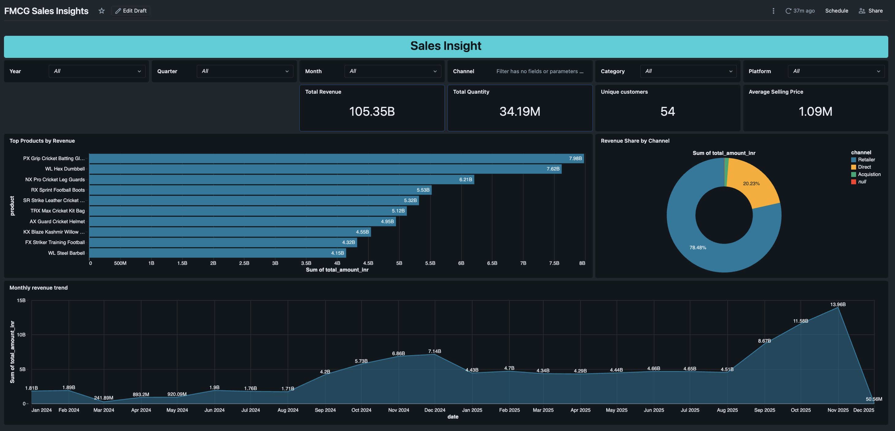
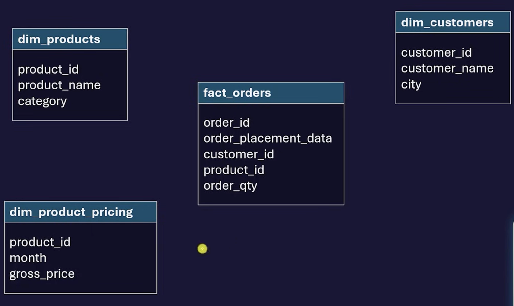
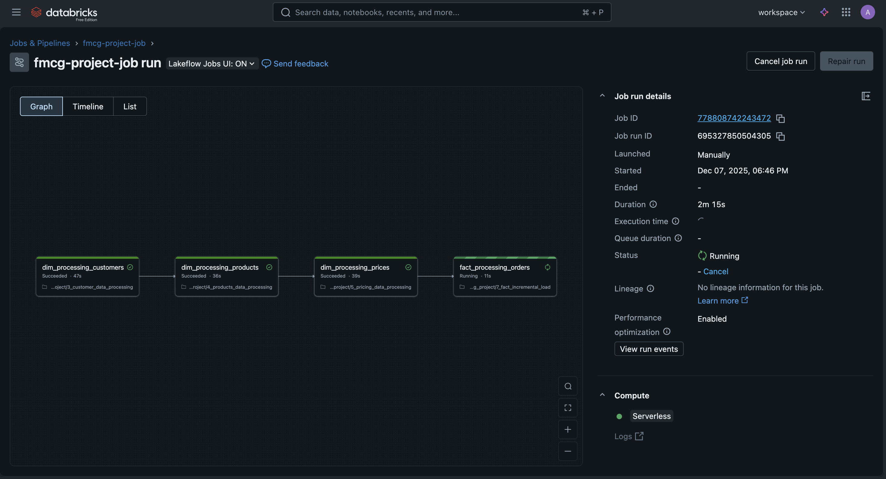
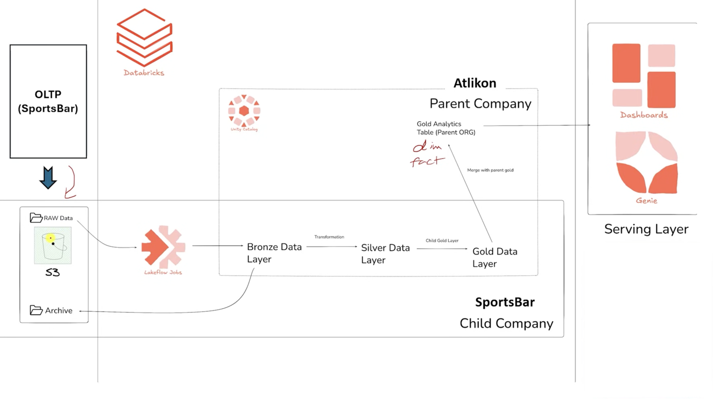

# FMCG Retail Data Consolidation ETL Pipeline

*A real-world data engineering project using Lakehouse + Medallion Architecture*

## Project Overview

In the FMCG domain, large retail organizations often grow through acquisitions. When a big retail company acquires a smaller one, their data ecosystems usually differ in structure, format, and technology.
This project simulates a real-life industry scenario where we consolidate data from **two retail companies** into a unified **Lakehouse Architecture** using a scalable ETL pipeline.

The pipeline extracts, transforms, and loads data into **Bronze → Silver → Gold** layers following the **Medallion Architecture**, enabling unified analytics and BI reporting.

---

## Project Screenshots

### Dashboard

### Data Model

### Databricks Jobs Pipeline

### Project Structure

---

## Architecture Overview

### **Tech Stack**

* **Python** – Data processing, orchestration scripts
* **SQL** – Transformations and Gold layer modeling
* **Amazon S3** – Lakehouse storage (Bronze/Silver/Gold)
* **Spark (PySpark)** – Distributed ETL computation
* **Medallion Architecture** – Bronze → Silver → Gold
* **BI Dashboard** – Insights generation (e.g., Tableau/Power BI)
* **Genie** – Query acceleration / Lakehouse query engine

---

## Lakehouse Data Flow (Medallion)

### **1. Bronze Layer – Raw Ingestion**

* Load raw data from both companies into S3 (CSV).
* No transformations, only ingestion and basic quality checks.
* Stores **raw sales, inventory, and product master data**.

### **2. Silver Layer – Standardization & Cleansing**

* Apply schema normalization for both companies.
* Deduplicate, validate, and harmonize columns.
* Conform dimensions (dates, products, stores).
* Output is **clean, query-ready structured data**.

### **3. Gold Layer – Business Models & KPIs**

* Build aggregated fact tables:

  * Sales fact
  * Inventory fact
  * Customer analytics
* Create unified models used by BI dashboards.
* Power BI/Tableau dashboard built on top of this layer.

---

## Features

* ✔️ End-to-end ETL pipeline from raw ingestion to BI-ready tables
* ✔️ Lakehouse storage using **Amazon S3**
* ✔️ Data standardization across two different companies
* ✔️ Scalable transformation engine using **Apache Spark**
* ✔️ Medallion architecture for clean, maintainable pipelines
* ✔️ Business insights dashboard powered by **Genie + BI tools**

---

## Example KPIs in Gold Layer

* Total Sales Revenue
* Inventory Turnover Rate
* Daily/Weekly/Monthly Sales Trends
* Top-performing FMCG categories
* Store-level growth comparison between the two companies

---

## BI Dashboard Output

The BI dashboard visualizes:

* Consolidated sales across both companies
* Category-level performance
* Inventory health
* Forecasting insights

